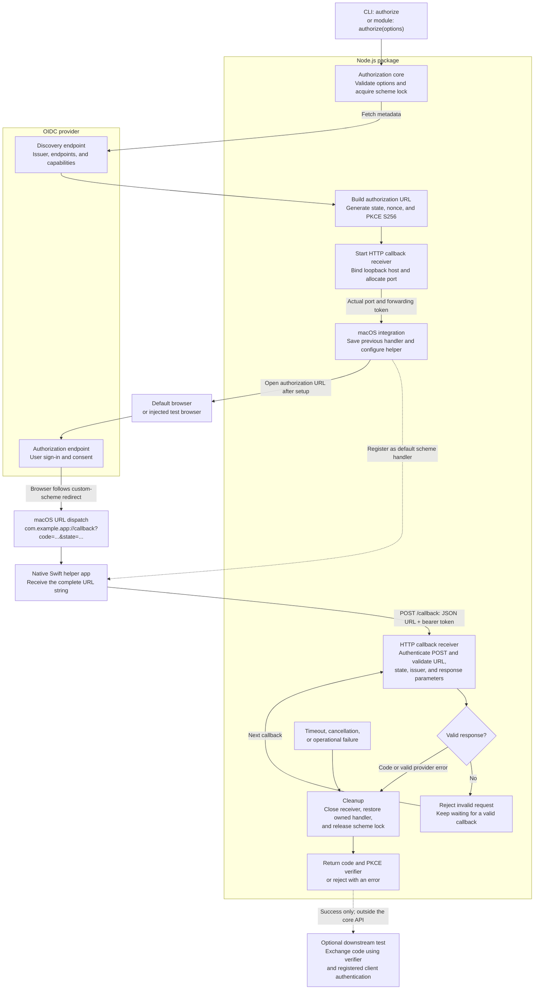

# @jzhuo3/oidc-client-emulator

A Node.js CLI and module for acquiring **OIDC authorization codes**, with a macOS
helper that forwards custom URL schemes such as `com.example.app://callback` to a
local HTTP receiver.

This version supports `response_type=code`, query responses, state, and PKCE S256.
It returns the code and PKCE verifier. It does not exchange codes, validate ID
tokens, or claim that the user has been authenticated.

## How the parts interact

The flow below shows **managed mode**, where one call owns the listener and the
temporary macOS handler. Both the CLI and module use the same authorization core.



The **registered redirect URI** and **internal HTTP endpoint** serve different
purposes. The provider redirects to `com.example.app://callback`; the helper
forwards that URL to `http://127.0.0.1:<port>/callback`. Port `0` asks the OS to
choose an available port, and managed mode passes that actual port to the helper.
The forwarding bearer token authenticates the local POST; `state` ties the OIDC
response to the pending request. The PKCE verifier stays in Node.js and is returned
with the code for a later token exchange.

| Mode | Who configures forwarding? | What happens after authorization? |
| --- | --- | --- |
| `managed` | `authorize` installs a temporary handler and uses the receiver's allocated or specified port | Closes the receiver and restores the previous handler if still owned |
| `existing` | `intercept on` saves a fixed host/port and selects the helper; `authorize` starts the matching receiver | Closes the receiver; forwarding stays enabled until `intercept off` |
| `none` | Your external relay forwards callbacks to the specified fixed port with the supplied token | Closes the receiver; the tool makes no macOS handler changes |

`intercept on` configures the helper but does not start the HTTP receiver.
`intercept status` reports the saved and current handler state; `intercept off`
disables forwarding and restores the previous handler when appropriate. Cleanup
after an error applies to resources already acquired; interrupted recovery can
be retried with `intercept off` as described below.

## Requirements

- Node.js 22 or later.
- macOS 12 or later and a logged-in desktop session for custom scheme handling.
- Xcode Command Line Tools (`xcode-select --install`), or Xcode. The Swift helper
  is compiled and ad-hoc signed on first use. Nothing runs at npm install time.
- A pre-registered OIDC client with the **exact** custom redirect URI and S256
  support. Include `openid` in scopes. No client secret is needed to acquire a code.

The native prototype and integration suite were tested on macOS 26.6.2. Older
macOS versions and Intel hardware remain unverified. This source-built release
does not yet ship precompiled/notarized native binaries.

## Build and run locally

```sh
npm ci
npm test
node dist/cli.js --help
npm pack
npm exec --package ./jzhuo3-oidc-client-emulator-0.1.0.tgz -- oidc-client-emulator --help
```

The package has not been published. Once it is published, the executable is
available as `npx @jzhuo3/oidc-client-emulator …`. It uses the [MIT License](LICENSE),
with copyright attributed to jzhuo3 (2026).
See [PUBLISHING.md](PUBLISHING.md) for GitHub CI, release-please, and npm trusted
publishing setup, including the first-release bootstrap.

## Acquire a code

```sh
node dist/cli.js authorize \
  --issuer https://identity.example.com \
  --client-id registered-client \
  --redirect-uri 'com.example.app://callback' \
  --scope 'openid email profile' \
  --intercept managed \
  --json
```

The listener starts before the browser opens. Managed mode temporarily selects
the helper as the scheme handler, waits for a valid response, closes the receiver,
and restores the previous application. A valid provider error rejects immediately.
Invalid or unsolicited callbacks do not finish the pending attempt.

The JSON result contains `code`, `codeVerifier`, `state`, `nonce`, `redirectUri`,
`issuer`, optional `tokenEndpoint`, and `receivedAt`. Keep `codeVerifier` for a
downstream token request. Codes are single-use: a verification exchange consumes
the code. Result JSON goes to stdout; diagnostics go to stderr without codes,
verifiers, client secrets, or tokens. Treat captured stdout as sensitive.

Example successful result (illustrative values only; not real credentials):

```json
{
  "code": "example-authorization-code",
  "codeVerifier": "abcdefghijklmnopqrstuvwxyz0123456789ABCDEFG",
  "state": "example-random-state",
  "nonce": "example-random-nonce",
  "redirectUri": "com.example.app://callback",
  "issuer": "https://identity.example.com",
  "tokenEndpoint": "https://identity.example.com/oauth2/token",
  "receivedAt": "2026-09-11T08:30:00.000Z"
}
```

The CLI writes this object to stdout; the module's `authorize()` Promise resolves
with the same shape. A downstream token exchange uses `code`, `codeVerifier`, and
the exact `redirectUri`, together with the registered client ID and its required
authentication. `state` correlates the callback with this request; `nonce` is
available for later ID-token validation. `receivedAt` is the local receipt time,
not the code's expiry time. `tokenEndpoint` is omitted if discovery does not
provide one.

Failures do not return this success object: the module rejects with an error,
and the CLI writes a diagnostic to stderr and exits with a nonzero status.

Optional flags:

| Flag | Behavior |
| --- | --- |
| `--host 127.0.0.1` | Receiver bind address; also accepts `::1` |
| `--port 0` | Choose an available port in managed mode, or specify a fixed port |
| `--timeout-ms 300000` | Overall authorization deadline, independent of code TTL |
| `--discovery-url URL` | Explicit discovery URL; the returned issuer must still match |
| `--param prompt=login` | Extra authorization parameter; repeat as needed |
| `--no-open` | Print the authorization URL to stderr for manual opening |
| `--state-dir PATH` | Override the persistent helper/configuration directory |

State, nonce, PKCE fields, client ID, redirect URI, response type/mode, and scope
cannot be replaced through `--param`. Discovery is HTTPS-only, does not follow
redirects, and does not supply authorization-code TTL.

## Module and testing frameworks

```ts
import { authorize } from '@jzhuo3/oidc-client-emulator';

const controller = new AbortController();
const result = await authorize({
  issuer: 'https://identity.example.com',
  clientId: 'registered-client',
  redirectUri: 'com.example.app://callback',
  scopes: ['openid', 'email'],
  callback: { host: '127.0.0.1', port: 0 },
  interception: 'managed',
  timeoutMs: 300_000,
  signal: controller.signal,
});

// Pass result.code, result.codeVerifier, and result.redirectUri to your token test.
```

Supply `openBrowser: async url => { … }` to drive your testing framework's browser
instead of the macOS default. `onAuthorizationUrl` runs once the receiver and
handler are ready, before browser opening. Use `openBrowser: false` when the hook
handles navigation. The browser's custom-scheme dispatch still needs macOS.

The library installs no process-wide signal handlers and has no import-time side
effects. The CLI handles SIGINT/SIGTERM and attempts cleanup before exiting.

## Persistent on/off switch

```sh
node dist/cli.js intercept on --scheme com.example.app --host 127.0.0.1 --port 43119
node dist/cli.js intercept status --scheme com.example.app

node dist/cli.js authorize \
  --issuer https://identity.example.com \
  --client-id registered-client \
  --redirect-uri 'com.example.app://callback' \
  --intercept existing --json

node dist/cli.js intercept off --scheme com.example.app
```

`intercept on` enables forwarding; it does **not** start an HTTP server. Run
`authorize --intercept existing` to start the matching receiver. Existing mode
reads its host, port, and authentication token from the saved configuration and
leaves interception enabled afterward. Repeating identical `on` settings is
idempotent; changing an active destination requires `off` first.

Module equivalents are `interceptOn`, `interceptOff`, and `interceptStatus`.
Status omits the forwarding token. Persistent settings, helper binaries, and
recovery records live under `~/Library/Application Support/oidc-client-emulator`
by default, with user-only configuration permissions.

The helper forwards the exact URL string **received from macOS** as JSON:

```http
POST /callback
Content-Type: application/json
Authorization: Bearer <local-forwarding-token>

{"url":"com.example.app://callback?code=...&state=..."}
```

It preserves query escaping and fragments without reconstructing the URL. The
OIDC receiver accepts query responses only. The HTTP endpoint is separate from
the registered redirect URI. Forwarding currently supports loopback addresses
only; remote hosts/public interfaces are rejected.

For an external relay or platform-independent tests, use `interception: 'none'`
with a fixed `callback.port` and a `callback.token` containing 32–256 base64url
characters. Have the relay POST to `/callback` using that bearer token. The CLI
reads this token from `OIDC_CALLBACK_TOKEN`. Loopback mock providers can use the
module-only `allowInsecureHttp: true`; arbitrary remote HTTP providers remain
disallowed.

## Ownership and recovery

Changing the default handler affects the **entire scheme**, not just `/callback`,
and macOS may ask for consent. Normal cleanup restores the previous handler only
if our helper still owns the scheme. A later user/application change is preserved.
If no application previously handled the scheme, cleanup unregisters and removes
the helper. This uses the macOS `lsregister` utility, whose behavior is covered by
the native integration test but should be rechecked on other macOS releases.

Only one authorization attempt per scheme/state directory is supported. Keep the
default shared state directory for normal use; separate directories do not
coordinate ownership of the same scheme. Overlapping attempts fail with `BUSY`.

SIGKILL, power loss, or a missing previous application can prevent immediate
restoration. After restarting, run:

```sh
node dist/cli.js intercept off --scheme com.example.app
```

Use the same `--state-dir` if you supplied one. Recovery state is retained if
restoration fails, and forwarding is disabled before retrying restoration. If the
previous app was removed, reinstall it at its original location or choose another
handler, then retry `off`. The OS cannot restore an app that no longer exists.

## Verification

```sh
npm test                 # Mock OIDC and callback validation/lifecycle tests
npm run test:macos       # Disposable native schemes and apps; requires GUI access
npm run test:package     # Packed installation, exports, executable, and npm exec
npm run test:live        # Real sign-in and code exchange; reads ignored .env
```

Copy `.env.sample` to `.env` and fill in your client credentials for the live smoke
test. It uses these environment variables:

```dotenv
OIDC_ENDPOINT=https://identity.example.com
OIDC_CLIENT_ID=registered-client
OIDC_CLIENT_SECRET=local-secret
OIDC_REDIRECT_URI=com.example.app://callback
OIDC_SCOPES=openid email profile
# Optional; must match the client's registration:
OIDC_TOKEN_ENDPOINT_AUTH_METHOD=client_secret_basic
```

`client_secret_post` is also supported by this smoke test. It validates the token
endpoint response and requires an ID token. It verifies the RS256 signature using
the provider's HTTPS JWKS endpoint, checks issuer, audience, expiry, issued-at time,
subject, and authorized party when applicable, and requires the ID token's `nonce`
to equal the nonce generated by `authorize()`. Missing or mismatched nonces fail
the test. This smoke test currently supports RS256-signed ID tokens only.

Only after all checks pass does it print `verified: true`, `idTokenValidated: true`,
and `nonceValidated: true`, alongside the token-receipt and handler-cleanup flags.
It discards tokens and does not print tokens or personal claims. These checks are
part of the live-test script; the public `authorize()` API still stops at a code.
`.env` is excluded from Git and npm artifacts;
the package's file allowlist includes only compiled code, native source, and docs.

The live test uses `.prototype/live-state`; if interrupted abruptly, recover with
`node dist/cli.js intercept off --scheme com.example.app --state-dir .prototype/live-state`.

## Deferred

Token exchange and ID-token validation in the public API, HTTP redirect URIs,
fragment/form_post responses, PAR/JAR, implicit/hybrid flows, remote forwarding,
parallel attempts for one scheme, and prebuilt native distribution are outside
this first version. A provider/client that mandates PAR/JAR needs additional work.
